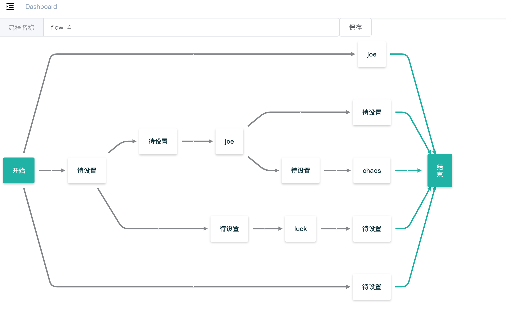

# go-workflow
Build interactive flowcharts or flow diagrams

## Users
``` 
curl --location --request POST 'http://localhost:9999/api/kv/user/user' \
--header 'Content-Type: application/json' \
--data-raw '[{"name":"chaos","des":""},{"name":"joe","des":"asd"},{"name":"luck","des":"asd"}]'
```
